# 마음날씨 (HeartCast)

> 아이에게는 **날씨 놀이**, 부모에게는 **마음 리포트**.

유치원·어린이집 아이들은 선생님, 친구, 교실 분위기를 어떻게 느끼는지 말로 표현하기 어려워요. CCTV에는 **말소리와 눈빛**이 담기지 않아서 정서적인 어려움은 잘 드러나지 않습니다.
**마음날씨**는 아이가 게임처럼 선생님·친구 아바타에 날씨 스티커를 붙이고 표정을 고르게 합니다. 그 결과를 부모가 **판정 없이 흐름으로** 볼 수 있게 정리하고, 아이와 나눌 **"그랬구나" 공감 대화**를 도와줍니다.

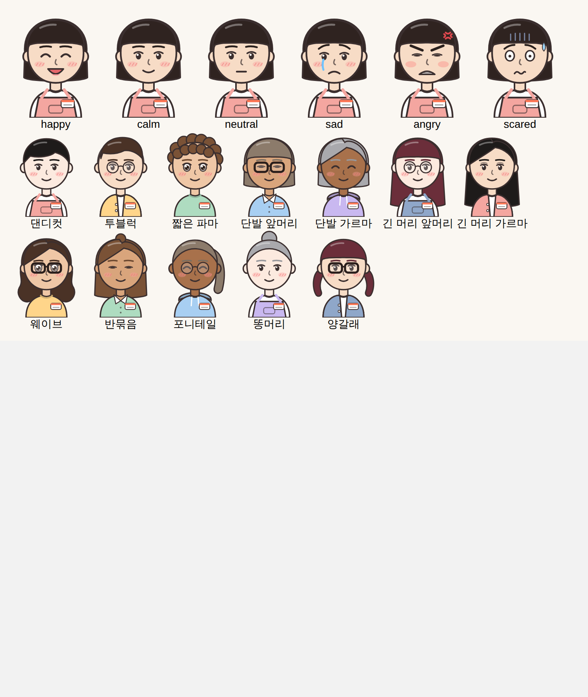

| 시작 | 선생님 공방: 얼굴 | 아이 홈 | 날씨 놀이 |
|---|---|---|---|
| 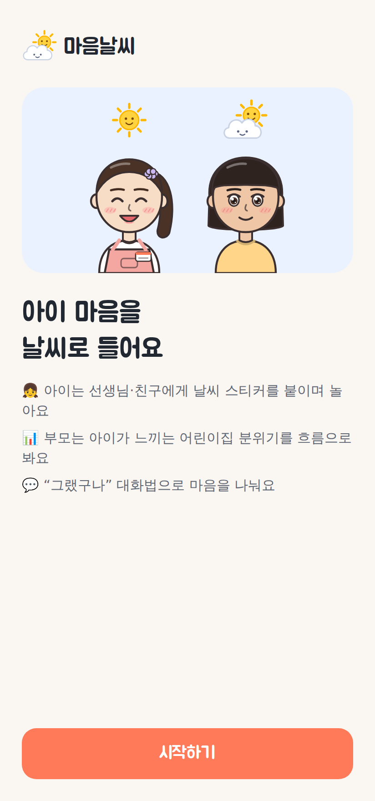 | 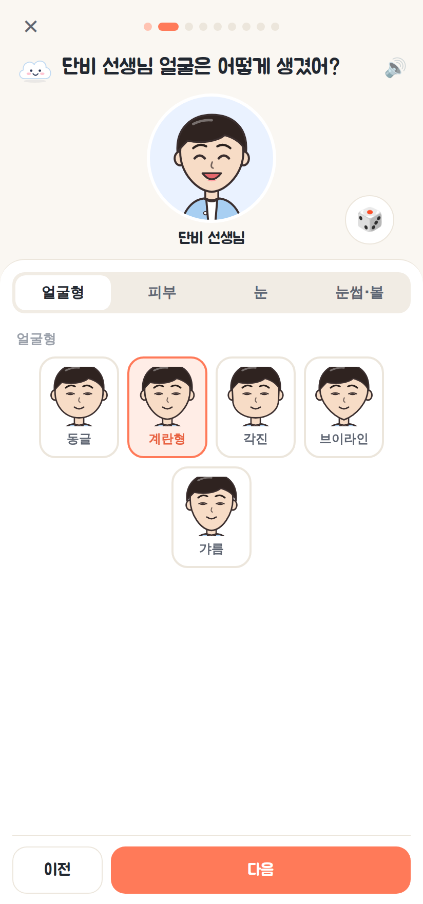 | 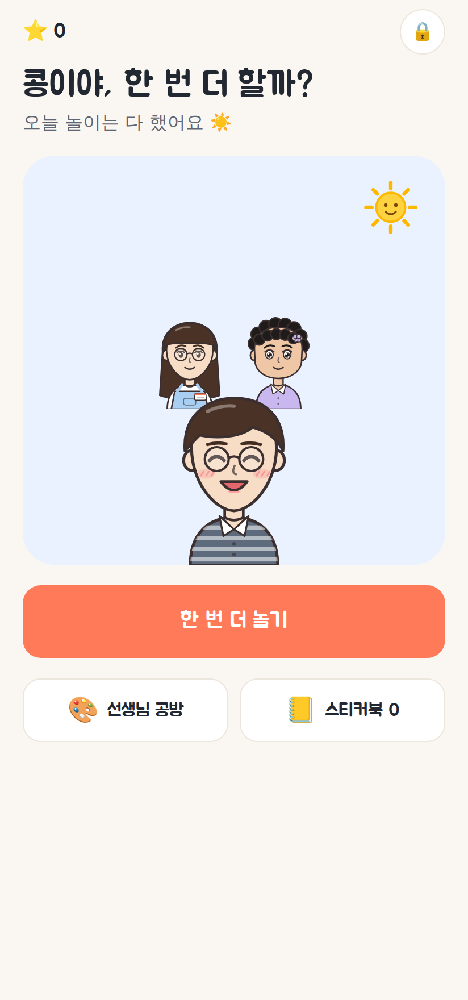 | 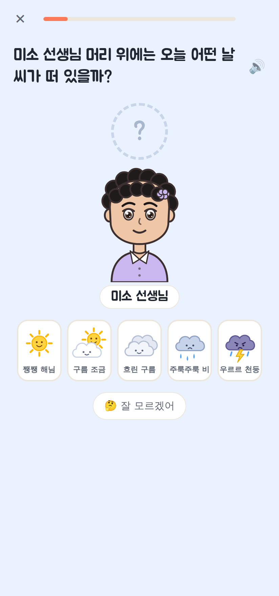 |

| 표정 놀이 | 이야기 장면 놀이 | 부모 리포트 | 그랬구나 카드 |
|---|---|---|---|
| 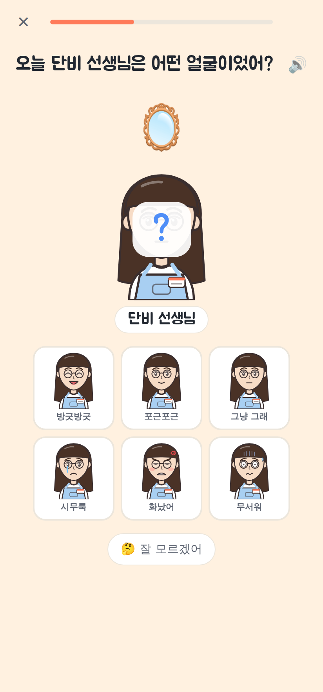 | 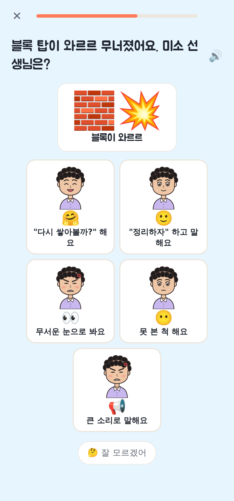 | 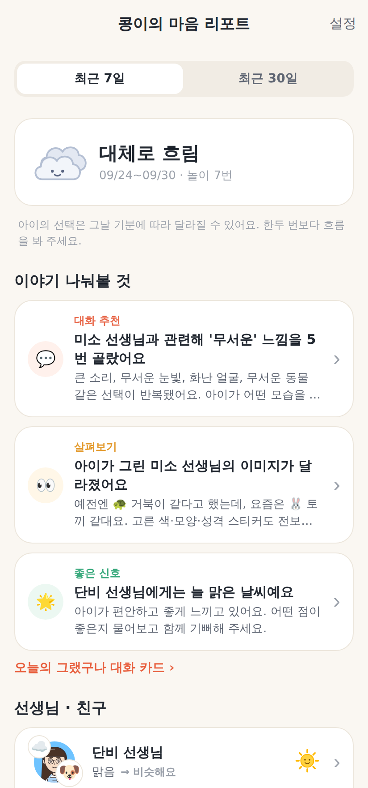 | 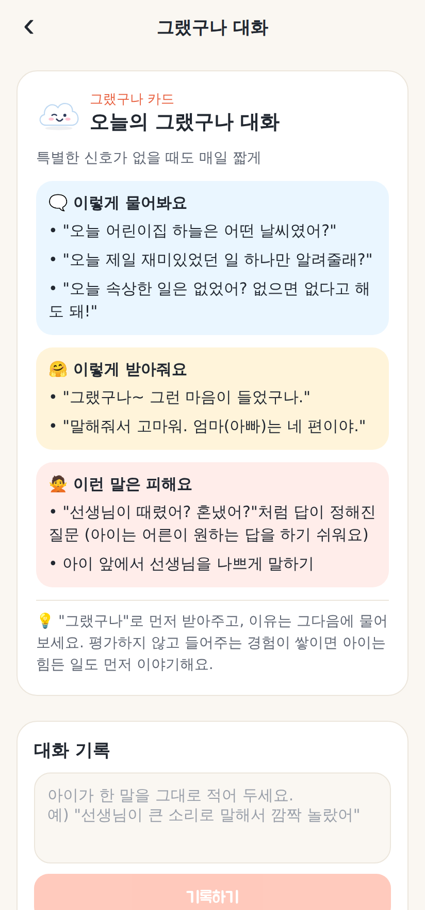 |

**🎨 선생님 공방**

| 머리 고르기 | 성격 색깔 | 닮은 동물 | 완성! | 공방 | 부모: 아이가 그린 이미지 |
|---|---|---|---|---|---|
| 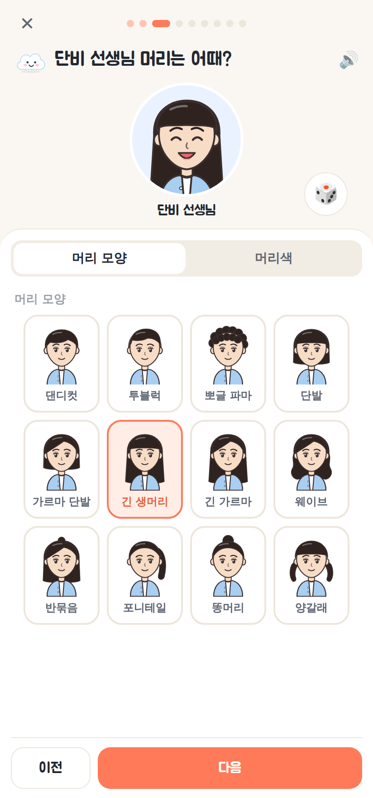 | 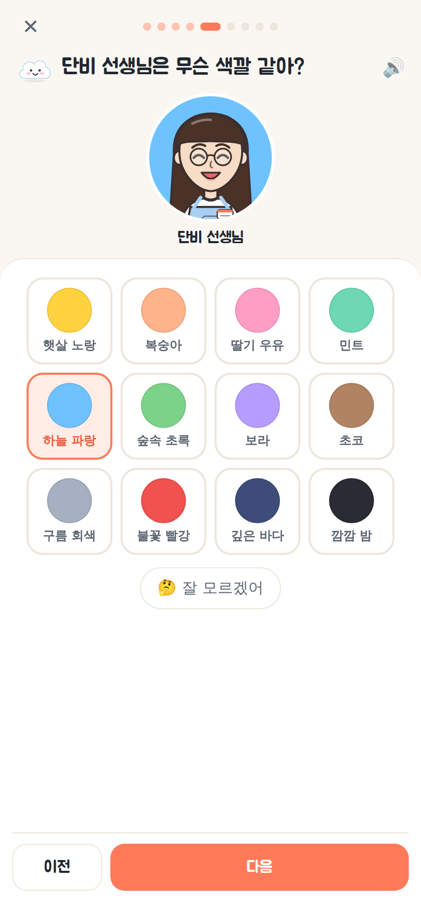 | 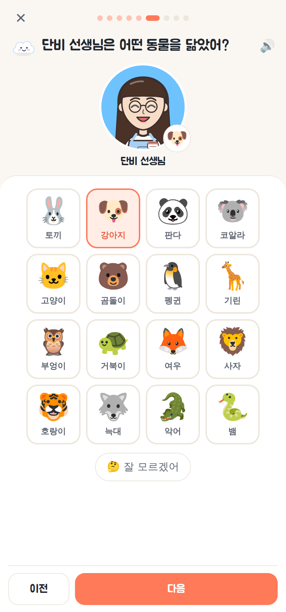 | 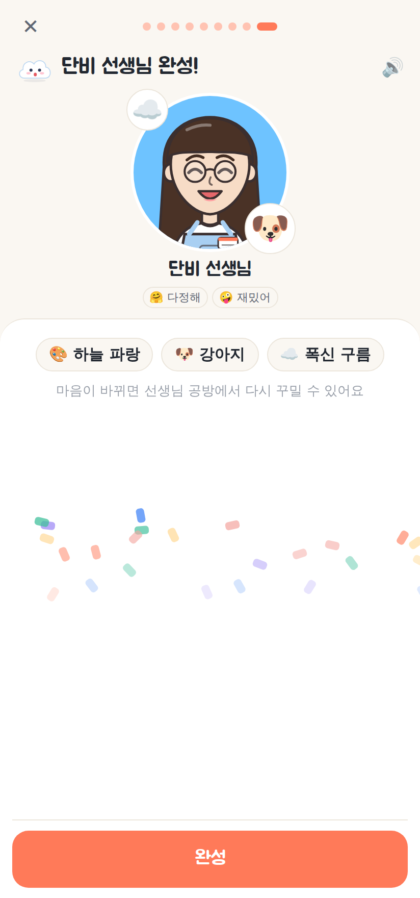 | 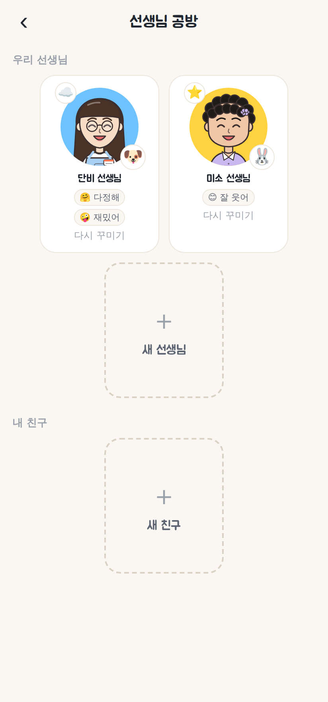 | 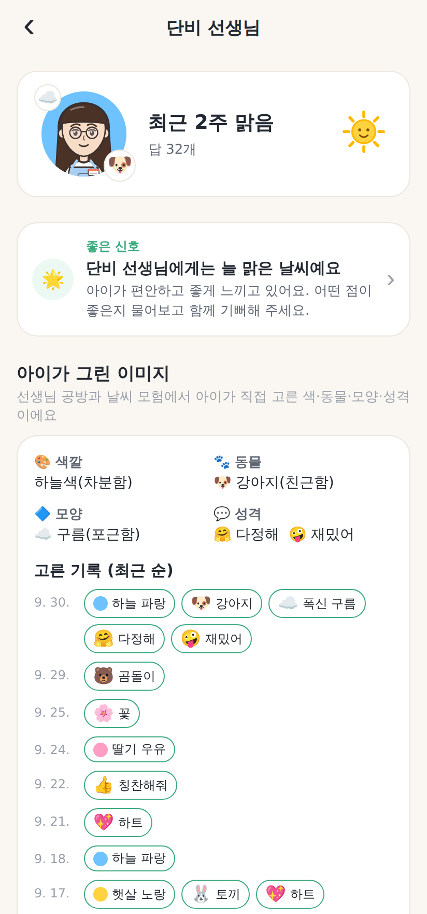 |

## 주요 기능

### 1. 쉽고 재미있는 처음 설정 (부모 + 아이 함께)
구름 캐릭터 **마루**가 말풍선으로 단계마다 안내하고, 해님이 하늘을 건너가며 진행 상황을 보여줍니다.
1. 소개 슬라이드 3장
2. 계정: 이메일 가입/로그인(Supabase) 또는 **로그인 없이 체험**
3. 우리 아이 이름·반 이름과 **아바타 꾸미기** (머리·머리색·피부·옷·꾸미기, 🎲 랜덤)
4. **🎨 선생님 공방에서 선생님 만들기** (최대 8명): 아이가 직접 만듭니다 (아래 참고)
5. 친한 친구도 같은 공방에서 만들기 (선택, 최대 8명)
6. 부모 전용 PIN 4자리
7. 🎉 완료 축하 화면

### 아바타: 일상툰(웹툰) 스타일
- 진갈색 외곽선과 평평한 채색, 눈·코·입이 있는 얼굴, 웹툰식 볼터치(사선 세 줄)
- 표정 6종에 웹툰 감정 기호를 더했습니다: 😠 핏대, 😢 눈물 줄기, 😨 식은땀·그늘선
- 한국에서 흔한 머리 모양: 댄디컷, 투블럭, 뽀글 파마, 단발, 가르마 단발, 긴 생머리, 긴 가르마, 웨이브, 반묶음, 포니테일, 똥머리, 양갈래
- 원복 앞치마, 카디건, 맨투맨, 셔츠, 후드와 **이름표**, 뿔테 안경, 똑딱핀, 곱창밴드
- 예전 버전의 아바타 데이터는 `normalizeAvatar`가 새 형식으로 자동 변환합니다.

### 2. 🎨 선생님 공방 (아바타 게임처럼 선생님 만들기)
마루가 단계마다 질문을 소리 내어 읽어주고, 아이는 그림을 눌러 고르기만 하면 됩니다. 위쪽 미리보기는 고를 때마다 통통 튀며 바로 바뀝니다.

| 단계 | 마루의 질문 | 고를 수 있는 것 |
|---|---|---|
| ✏️ 이름 | "누구 선생님을 만들어 볼까?" | 이름 (부모가 도와 입력) |
| 🙂 얼굴 | "얼굴은 어떻게 생겼어?" | 탭: 얼굴형 5 · 피부 5 · 눈 5 · 눈썹 3 · 볼 |
| 💇 머리 | "머리는 어때?" | 탭: 머리 모양 12 · 머리색 7 |
| 👕 옷·소품 | "뭘 입고 있어?" | 탭: 옷 5 · 색 8 · 무늬 3 · 안경 · 머리 장식 6 · 이름표 |
| 🎨 색깔 | "선생님은 무슨 색깔 같아?" | 물감 12색 (햇살 노랑 ~ 깜깜 밤) |
| 🐾 동물 | "어떤 동물을 닮았어?" | 16마리 (토끼·강아지·판다 ~ 사자·호랑이·늑대·뱀) |
| 🔷 모양 | "어떤 모양 같아?" | 9가지 (별·하트·구름 ~ 뾰족 세모·번개·얼음) |
| 💬 성격 | "어떤 사람이야?" | 스티커 12개 중 최대 3개 (다정해·재밌어 ~ 무서워·소리 질러) |
| 🎉 완성 | "짜잔! ○○ 선생님 완성!" | 선생님 카드 공개 + 색종이 |

- 모두 **8단계**이고, 한 단계 안의 여러 항목은 작은 탭으로 나눠 한 번에 한 줄씩만 보여줍니다. 진행은 점(●○○)으로, 버튼은 [이전]·[다음] 두 개뿐입니다.
- 생김새 단계에는 미리보기 옆 🎲 **랜덤** 버튼이 있어 빠르고 재밌게 만들 수 있습니다.
- 색·동물·모양·성격은 **아이가 선생님을 어떻게 느끼는지 보여주는 데이터**입니다. 그래서 이 단계에는 랜덤이 없고, 대신 "🤔 잘 모르겠어"를 고를 수 있습니다. 선택지에는 편안한 것과 무서운 것이 섞여 있어서 아이가 느낌을 있는 그대로 표현할 수 있습니다.
- **선생님 카드**는 성격 색을 배경으로 하고, 닮은 동물과 모양 배지, 성격 스티커가 함께 보입니다.
- 아이 홈의 **🎨 선생님 공방**에서 언제든 새로 만들거나 **다시 꾸밀** 수 있고, 다시 꾸미면 변화가 기록됩니다.
- 지우기는 부모 설정(PIN)에서만 할 수 있습니다.

### 3. 아이 놀이 모드: "날씨 모험" (하루 약 6문항, 5분)
- **날씨 스티커 놀이**: "○○ 선생님 머리 위에는 오늘 어떤 날씨가 떠 있을까?" 해님, 구름 조금, 흐림, 비, 천둥 중에서 고릅니다.
- **표정 골라주기**: 얼굴이 가려진 선생님 아바타를 보고 6가지 표정(방긋, 포근, 그냥, 시무룩, 화났어, 무서워) 중에서 고릅니다.
- **이야기 장면 놀이**: 우유를 쏟았을 때, 블록이 무너졌을 때, 잠이 안 올 때 같은 상황 그림을 보고, 선생님이 어떻게 할지 고릅니다. 다정하게 도와줌, 차분하게 알려줌, 모른 척함, 큰 소리, 무서운 눈빛 중에서 고르며, 보기 순서는 매번 섞입니다.
- **오늘의 선생님 이미지**: 한 번의 놀이마다 "오늘 ○○ 선생님은 어떤 동물을 닮았어?"를 1문항 묻습니다. 동물, 색, 모양, 성격 순으로 돌아가며 묻고, 예전 답은 가려서 아이가 따라 고르지 않게 했습니다.
- 선생님만 묻지 않고 **친구, 밥, 낮잠, 놀이, 나 자신**도 섞어서 묻습니다. 그래서 "선생님 시험"이 아니라 놀이로 느껴집니다.
- 모든 질문을 **음성(TTS)으로 읽어줍니다**. 글을 못 읽는 아이도 할 수 있어요. 🔊를 누르면 다시 들을 수 있습니다.
- 정답은 없습니다. 무엇을 골라도 마루가 "고마워!"라고 칭찬하고, `🤔 잘 모르겠어`도 고를 수 있습니다.
- 다 하면 ⭐ 별을 받고 🎁 선물 상자에서 스티커가 나옵니다. 모은 스티커는 📒 스티커북에서 볼 수 있어요.

### 4. 부모 리포트 (PIN 잠금)
- **한 줄 요약**: 이번 주 전체 마음날씨와 교실 하늘을 요일별로 보여줍니다.
- **함께 이야기 나눠볼 것** (신호)
  - 💬 대화 추천: 한 사람과 관련해 무서운 장면(큰 소리, 무서운 눈빛, 화난·무서운 얼굴)을 2번 이상 골랐거나, 흐린 날씨를 3번 연속 골랐을 때
  - 👀 살펴보기: 평균 날씨가 흐림 이하이거나, 지난 기간보다 크게 흐려졌을 때
  - 👀 이미지 변화: 아이가 그린 선생님 이미지가 전보다 크게 어두워졌을 때 (예: "예전엔 🐶 강아지 같다고 했는데, 요즘은 🦁 사자 같대요")
  - 🌟 좋은 신호: 늘 맑은 날씨일 때
  - 무서운 동물·색·성격 스티커도 두려움 신호에 함께 반영됩니다
- **선생님·친구별 카드**: 평균 날씨, 추세, 7일 날씨 줄, 날씨 분포
- **상세 화면**: **아이가 그린 이미지**(지금의 색·동물·모양·성격과 날짜별 변화 기록), 14일 추이 그래프, 아이가 고른 표정, 이야기 장면에서 떠올린 모습, 전체 기록
- **그랬구나 대화 카드**: 열린 질문, 공감 반응, 피해야 할 말(유도 질문 등), 팁
- **대화 기록**: 아이가 한 말을 그대로 적어 둘 수 있습니다
- 리포트에는 "아이의 선택은 그날 기분에 따라 달라질 수 있어요"라는 안내가 항상 표시됩니다. 판정이나 고발이 아니라 **대화의 실마리**로 쓰도록 설계했습니다.

## 디자인 원칙
- 따뜻한 흰색 바탕 한 가지 색, 코랄 주조색 하나, 그림자 대신 얇은 테두리
- 한 화면에 주요 버튼 하나. 문구는 짧게 하고 장식용 이모지는 줄였습니다.
- 아이용 제목과 버튼은 둥근 Jua 글꼴, 본문과 부모 화면은 시스템 글꼴(안드로이드 Noto Sans KR)
- 부모 리포트는 목록 형태: 요약 한 줄 → 이야기 나눠볼 것(최대 3개) → 사람 목록 → 하루 속 순간들 → 최근 기록

## 기술 스택
- **Expo SDK 57** (React Native 0.86, Expo Router, TypeScript), Android 우선이며 iOS와 웹도 같은 코드로 빌드됩니다.
- **Supabase** (Auth + Postgres + Row Level Security): 모든 데이터가 `family_id = auth.uid()`로 보호됩니다.
- `react-native-svg`로 직접 그린 아바타, 날씨, 마스코트 일러스트 (이미지 파일이 필요 없음)
- `expo-speech`(질문 읽어주기), `expo-haptics`(터치 진동), `@expo-google-fonts/jua`(둥근 한글 폰트)

```
src/
  app/                 # 화면 (Expo Router)
    onboarding/        #   처음 설정 7단계
    play/              #   아이 놀이 (홈, 세션, 스티커북)
    parent/            #   부모 (PIN, 리포트, 상세, 대화 카드, 설정)
  components/          # 아바타(avatar/parts.tsx)·날씨·마스코트·UI, 게임, 리포트 차트
    studio/            #   선생님 공방(Studio), 선생님 카드, 고르기 판
  games/               # 문항(content.ts), 선생님 이미지 선택지(persona.ts), 코스 구성(planner.ts)
  lib/avatar.ts        # 아바타 파츠 목록, 예전 데이터 변환, 랜덤
  report/              # 리포트 분석(analyze.ts), 대화 카드(talkCards.ts) + 테스트
  data/                # 저장소: Supabase / 기기(체험 모드) / 예시 데이터
  state/               # 앱 상태(Context)
supabase/migrations/   # DB 스키마 + RLS
```

## 실행하기

```bash
npm install
npm start            # Expo 개발 서버 → Android 기기의 Expo Go 앱으로 QR 스캔
npm run android      # 에뮬레이터/연결된 기기에서 실행
npm run web          # 브라우저로 미리보기
```

`.env` 가 없으면 **체험 모드**로만 동작합니다. 이때 데이터는 기기에 저장되고, 설정 마지막 화면이나 부모 설정에서 "예시 기록 채우기"를 누르면 2주치 샘플 리포트를 볼 수 있습니다.

### Supabase(서버/계정) 연결
1. [supabase.com](https://supabase.com)에서 프로젝트를 만듭니다.
2. SQL Editor에서 `supabase/migrations/` 폴더의 SQL 파일(`0001_init.sql`, `0002_teacher_studio.sql`)을 번호 순서대로 실행합니다. Supabase CLI를 쓴다면 `supabase db push` 로도 됩니다.
3. `.env.example` 을 `.env` 로 복사하고 Project URL과 anon key를 넣습니다.
   ```
   EXPO_PUBLIC_SUPABASE_URL=https://xxxx.supabase.co
   EXPO_PUBLIC_SUPABASE_ANON_KEY=eyJ...
   ```
4. Authentication > Providers 에서 Email을 켭니다. 이메일 확인을 켜 두면 가입 후 메일 링크를 누른 뒤 로그인해야 합니다.

### Android 빌드 (APK/AAB)
```bash
npx eas-cli@latest build -p android --profile preview   # 테스트용 APK
npx eas-cli@latest build -p android                     # 스토어용 AAB
```

## 개발

```bash
npm test             # 리포트 분석·대화 카드·코스 구성 유닛 테스트
npm run typecheck    # 타입 검사
npm run lint         # ESLint (expo lint)
```

## 다음 단계 아이디어
- 부모 PIN 분실 시 계정 비밀번호로 재설정
- 형제자매용 여러 아이 프로필
- 주간 리포트 푸시 알림, PDF 내보내기(상담용)
- 아이가 직접 그리는 "오늘의 그림일기" (그림 + 음성 메모)
- 아동 발달·놀이치료 전문가와 함께 문항과 신호 기준 검증
