# 마음날씨 (HeartCast)

> 아이에게는 **날씨 놀이**, 부모에게는 **마음 리포트**.

유치원·어린이집 아이들은 선생님, 친구, 교실 분위기를 어떻게 느끼는지 말로 표현하기 어려워요. CCTV에는 **말소리와 눈빛**이 담기지 않아서 정서적인 어려움은 잘 드러나지 않습니다.
**마음날씨**는 아이가 게임처럼 선생님·반 친구·어른 아바타를 만들고, 날씨 스티커를 붙이고, 표정을 고르고, **서로의 관계를 선으로 잇게** 합니다. 그 결과를 부모가 **판정 없이 흐름으로** 볼 수 있게 정리하고, 아이와 나눌 **"그랬구나" 공감 대화**를 도와줍니다.


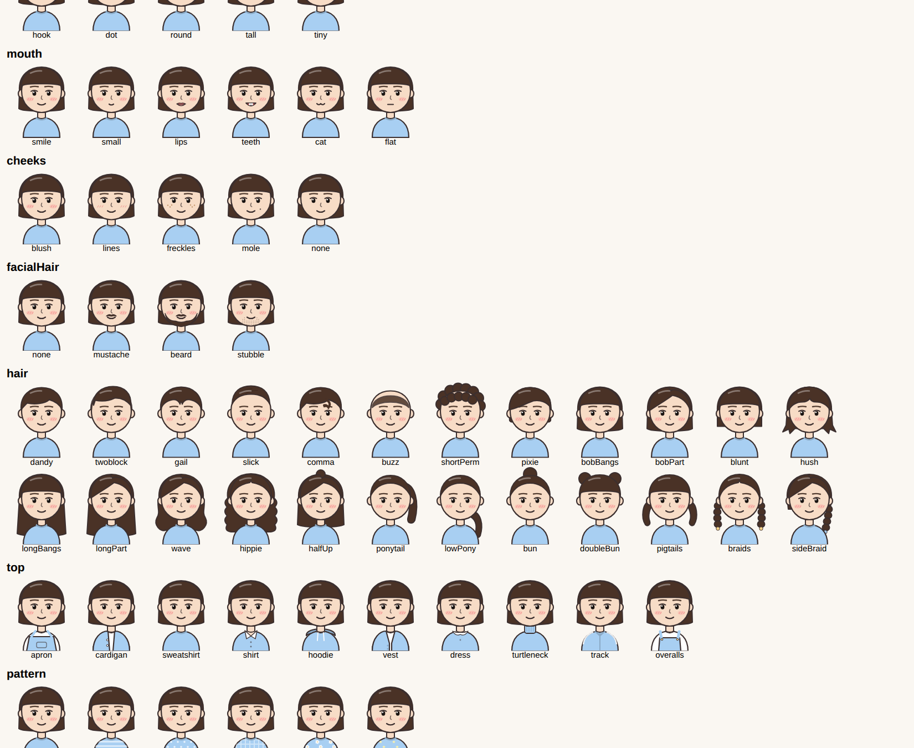
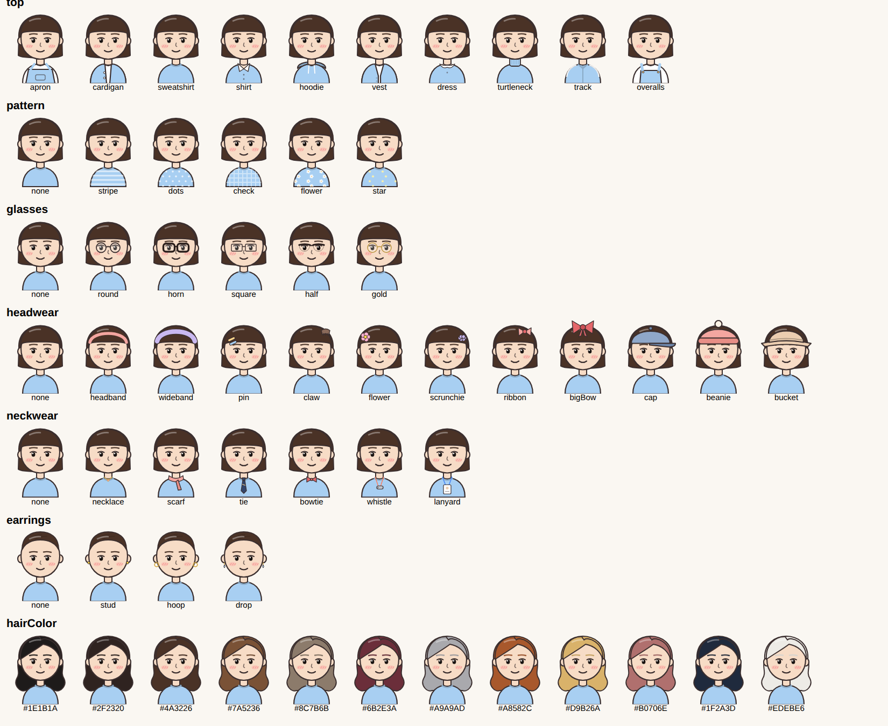

| 시작 | 공방: 닮은 얼굴 고르기 | 아이 홈 | 날씨 놀이 |
|---|---|---|---|
|  | 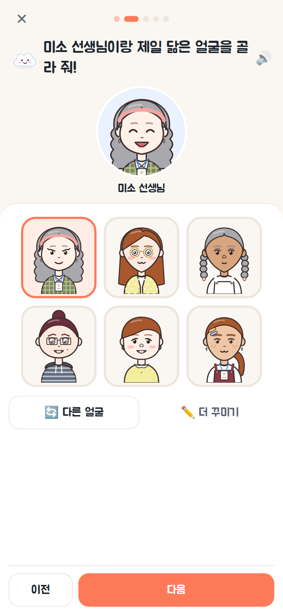 |  |  |

| 표정 놀이 | 이야기 장면 놀이 | 부모 리포트 | 그랬구나 카드 |
|---|---|---|---|
|  |  |  |  |

**🎨 공방**

| ✏️ 더 꾸미기 (선택) | 닮은 동물 | 성격 스티커 | 완성! | 공방 | 부모: 아이가 그린 이미지 |
|---|---|---|---|---|---|
| 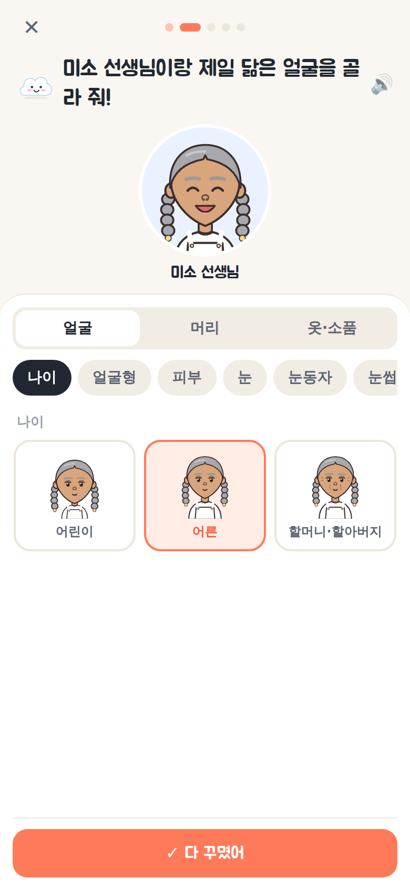 |  | 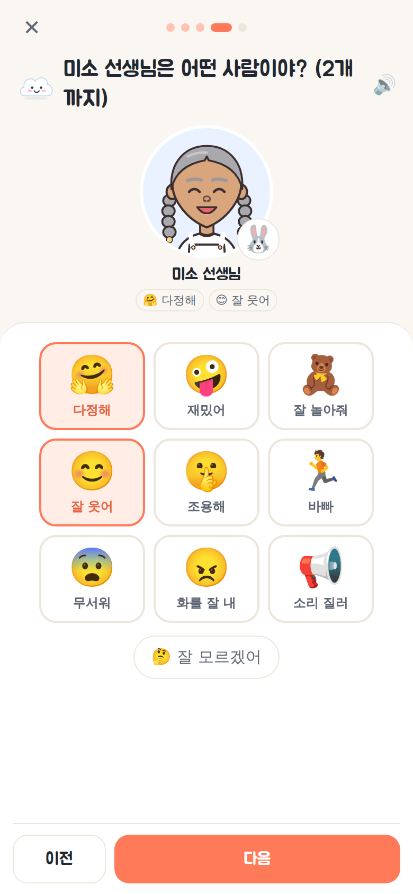 |  |  |  |

**🕸️ 관계도 놀이 · 친구·가족**

| 마루의 질문 | 얼굴 누르면 이어져요 | 처음 설정: 친구·가족 | 부모: 관계도 | 부모: 관계 신호 |
|---|---|---|---|---|
| 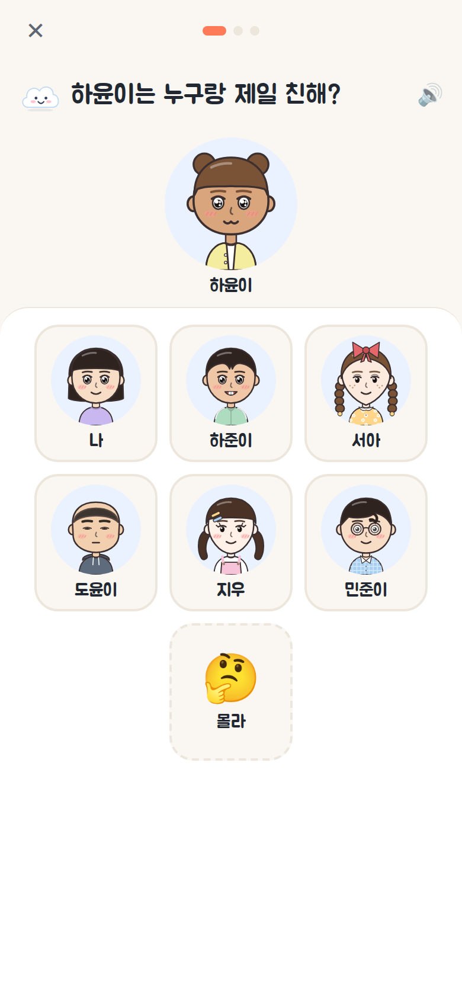 | 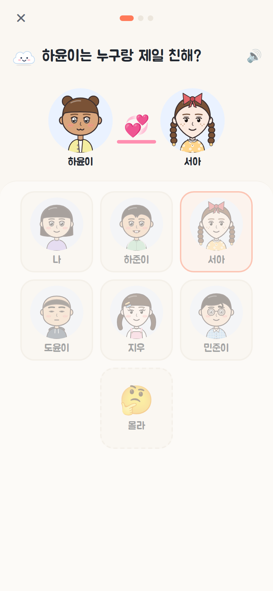 | 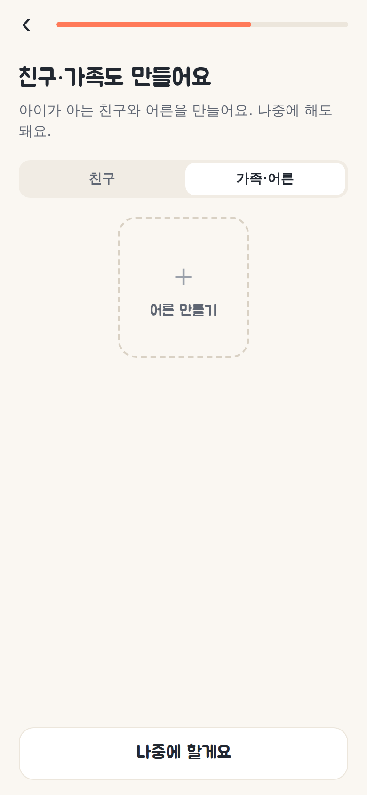 | 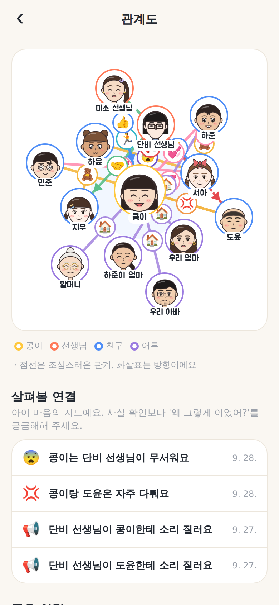 | 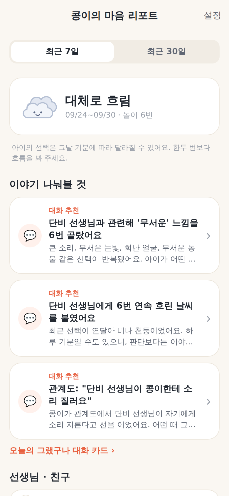 |

> **아이 화면은 단순하게**: 한 화면에 질문 하나와 큰 그림 버튼만 둡니다. 세부 옵션은 "✏️ 더 꾸미기"처럼 접어 두고, 복잡한 지도와 분석은 부모 화면에서만 보여줍니다.

**🖍️ 그림 놀이 · 어른들 사이의 관계**

| 누구를 그릴까 | 선생님 그리기 | 우리 반 그리기 | 두 사람 질문 | 부모: 우리 반 그림 | 부모: 그림 해석 |
|---|---|---|---|---|---|
| 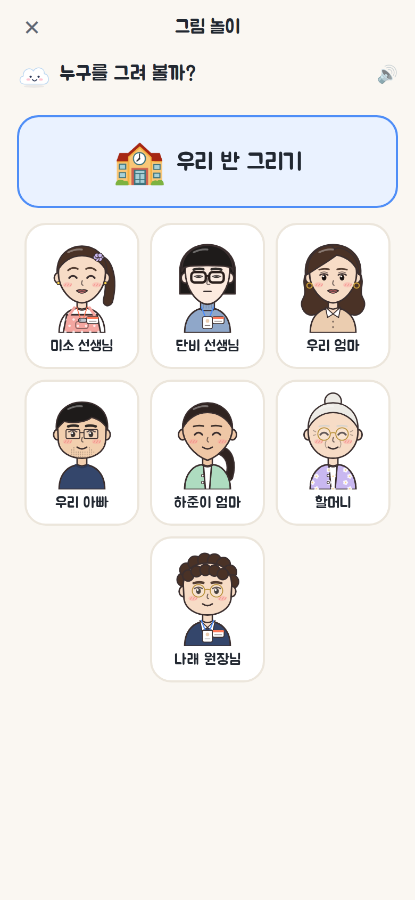 | 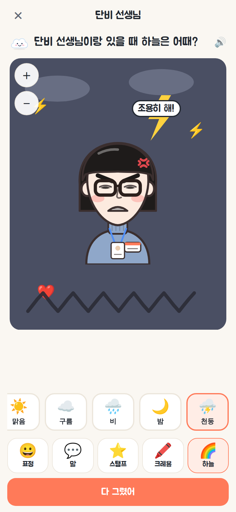 | 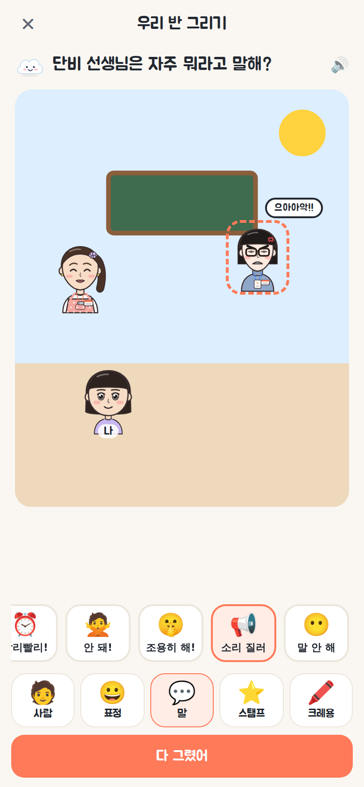 | 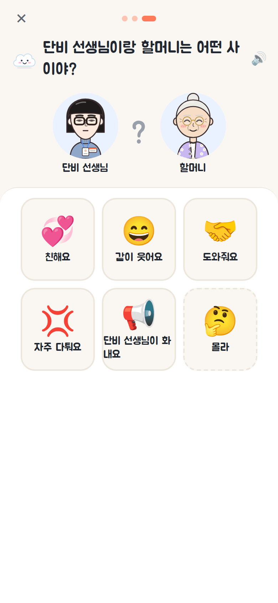 | 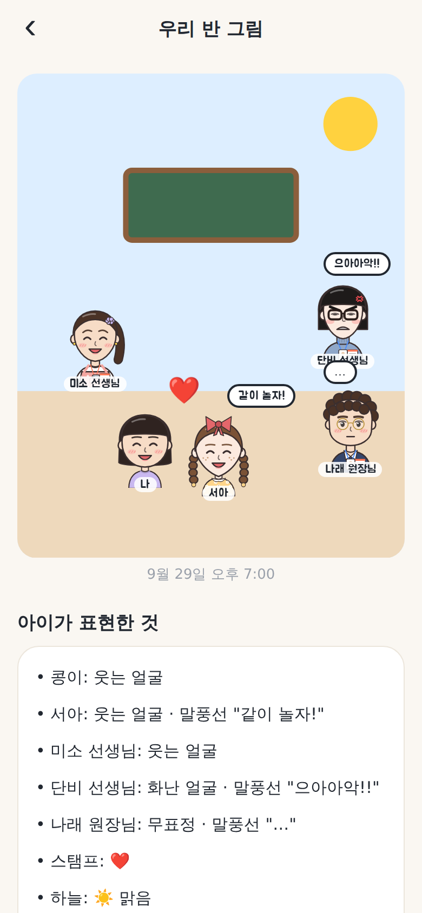 | 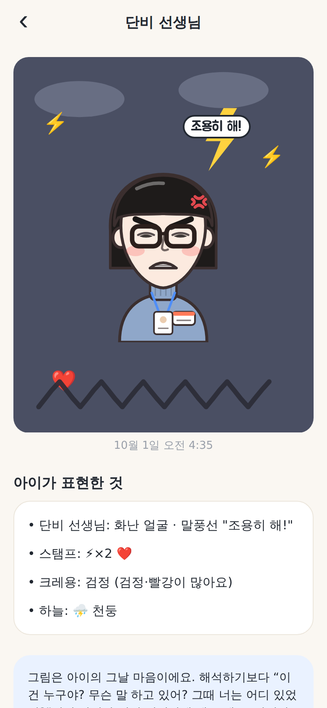 |

## 주요 기능

### 1. 쉽고 재미있는 처음 설정 (부모 + 아이 함께)
구름 캐릭터 **마루**가 말풍선으로 단계마다 안내하고, 해님이 하늘을 건너가며 진행 상황을 보여줍니다.
1. 소개 슬라이드 3장
2. 계정: 이메일 가입/로그인(Supabase) 또는 **로그인 없이 체험**
3. 우리 아이 이름·반 이름과 **아바타 꾸미기** (머리·머리색·피부·옷·꾸미기, 🎲 랜덤)
4. **🎨 공방에서 선생님 만들기** (최대 8명): 아이가 직접 만듭니다 (아래 참고)
5. **친구·가족** 만들기 (선택, 한 화면에 탭 두 개): 우리 반 친구 최대 30명, 우리 엄마·하준이 아빠·할머니 같은 어른 최대 12명
6. 부모 전용 PIN 4자리
7. 🎉 완료 축하 화면

### 아바타: 일상툰(웹툰) 스타일
- 진갈색 외곽선과 평평한 채색, 눈·코·입이 있는 얼굴, 웹툰식 볼터치(사선 세 줄)
- 표정 6종에 웹툰 감정 기호를 더했습니다: 😠 핏대, 😢 눈물 줄기, 😨 식은땀·그늘선
- 한국에서 흔한 머리 모양 24종
  - 짧은 머리: 댄디컷, 투블럭, 가일컷, 올백, 쉼표머리, 까까머리, 뽀글 파마, 숏컷
  - 단발: 단발, 가르마 단발, 똑단발, 허쉬컷
  - 긴 머리: 긴 생머리, 긴 가르마, 웨이브, 히피펌
  - 묶은 머리: 반묶음, 포니테일, 로우 포니, 똥머리, 만두머리, 양갈래, 땋은 양갈래, 한쪽 땋기
- 옷: 원복 앞치마, 카디건, 맨투맨, 셔츠, 후드, 조끼, 원피스, 목폴라, 체육복, 멜빵과 **이름표**
- 소품: 안경(동그란·뿔테·사각·반무테·금테), 머리 장식(머리띠·헤어밴드·똑딱핀·집게핀·꽃핀·곱창밴드·리본·큰 리본·모자·비니·버킷햇), 목 장식(목걸이·스카프·넥타이·나비넥타이·호루라기·목걸이 명찰), 귀걸이
- 얼굴: 눈 12종(쌍꺼풀·처진 눈·고양이 눈·반짝 눈 등)과 눈동자 색, 눈썹 7종, 코 5종, 입 6종, 볼·주근깨·점, 수염
- **나이 3단계**: 어린이(머리가 크고 몸이 작게), 어른, 할머니·할아버지(눈가·팔자 주름). 예전 데이터는 아이·친구는 어린이, 선생님·어른은 어른으로 채웁니다.
- 예전 버전의 아바타 데이터는 `normalizeAvatar`가 새 형식으로 자동 변환합니다.

### 2. 🎨 공방 (선생님·친구·가족 만들기)
마루가 질문을 소리 내어 읽어주고, 아이는 그림을 누르기만 하면 됩니다. 단계는 짧게 했습니다.

| 단계 | 마루의 질문 | 아이가 하는 일 |
|---|---|---|
| ✏️ 이름 | "누구 선생님을 만들어 볼까?" | 이름 (부모가 도와 입력) |
| 🙂 닮은 얼굴 | "미소 선생님이랑 제일 닮은 얼굴을 골라 줘!" | 큰 얼굴 6개 중 하나 누르기 · 🔄 다른 얼굴 |
| 🐾 동물 | "어떤 동물을 닮았어?" | 16마리 중 하나 (토끼·강아지 ~ 사자·호랑이·뱀) |
| 💬 성격 (선생님만) | "어떤 사람이야?" | 스티커 9개 중 2개까지 (다정해·재밌어 ~ 무서워·소리 질러) |
| 🎉 완성 | "미소 선생님 완성!" | 카드 공개 + 색종이 |

- 친구와 가족은 성격 단계 없이 **이름 → 얼굴 → 동물 → 완성**으로 끝납니다.
- 얼굴 단계의 **✏️ 더 꾸미기**를 누르면 세부 옵션이 펼쳐집니다(나이 3 · 얼굴형 9 · 눈 12 · 코 5 · 입 6 · 머리 24 · 머리색 12 · 옷 10 · 안경 · 머리 장식 · 목 장식 · 귀걸이 · 이름표 등). 기본 흐름에서는 보이지 않으니 부모와 함께 꾸밀 때 쓰면 됩니다.
- 동물·성격은 **아이가 그 사람을 어떻게 느끼는지 보여주는 데이터**라서 랜덤이 없고 "🤔 잘 모르겠어"가 있습니다. 색깔·모양은 놀이 중 "오늘의 선생님 이미지" 질문에서 하나씩 묻습니다.
- 아이 홈의 **🎨 공방**에서 탭(선생님 / 친구 / 가족·어른)을 골라 언제든 새로 만들거나 다시 꾸밀 수 있고, 다시 꾸미면 변화가 기록됩니다. 지우기는 부모 설정(PIN)에서만 할 수 있습니다.

### 3. 아이 놀이 모드: "날씨 모험" (하루 약 6문항, 5분)
- **날씨 스티커 놀이**: "○○ 선생님 머리 위에는 오늘 어떤 날씨가 떠 있을까?" 해님, 구름 조금, 흐림, 비, 천둥 중에서 고릅니다.
- **표정 골라주기**: 얼굴이 가려진 선생님 아바타를 보고 6가지 표정(방긋, 포근, 그냥, 시무룩, 화났어, 무서워) 중에서 고릅니다.
- **이야기 장면 놀이**: 우유를 쏟았을 때, 블록이 무너졌을 때, 잠이 안 올 때 같은 상황 그림을 보고, 선생님이 어떻게 할지 고릅니다. 다정하게 도와줌, 차분하게 알려줌, 모른 척함, 큰 소리, 무서운 눈빛 중에서 고르며, 보기 순서는 매번 섞입니다.
- **오늘의 선생님 이미지**: 한 번의 놀이마다 "오늘 ○○ 선생님은 어떤 동물을 닮았어?"를 1문항 묻습니다. 동물, 색, 모양, 성격 순으로 돌아가며 묻고, 예전 답은 가려서 아이가 따라 고르지 않게 했습니다.
- 선생님만 묻지 않고 **친구, 밥, 낮잠, 놀이, 나 자신**도 섞어서 묻습니다. 그래서 "선생님 시험"이 아니라 놀이로 느껴집니다.
- 모든 질문을 **음성(TTS)으로 읽어줍니다**. 글을 못 읽는 아이도 할 수 있어요. 🔊를 누르면 다시 들을 수 있습니다.
- 정답은 없습니다. 무엇을 골라도 마루가 "고마워!"라고 칭찬하고, `🤔 잘 모르겠어`도 고를 수 있습니다.
- 다 하면 ⭐ 별을 받고 🎁 선물 상자에서 스티커가 나옵니다. 모은 스티커는 📒 스티커북에서 볼 수 있어요.

### 4. 🕸️ 관계도 놀이 (질문 3개)
- 마루가 "하준이는 누구랑 제일 친해?", "미소 선생님은 누구를 자주 칭찬해?", "하준이 엄마는 누구네 가족이야?", "무섭거나 슬플 때 누구한테 달려가?"처럼 묻습니다.
- 위에는 질문의 주인공 얼굴이, 아래에는 **큰 얼굴 카드**가 있습니다. 하나를 누르면 두 얼굴이 💞 스티커로 이어지고, 마루가 "나랑 하준이는 친해요!"라고 읽어 준 뒤 다음 질문으로 넘어갑니다. "🙅 없어", "🤔 몰라"도 고를 수 있습니다.
- 한 판은 3문항입니다. 조심스러운 질문("큰 소리로 말하는 사람이 있어?" 등)은 최대 1개이고, 항상 편안한 질문으로 시작합니다. 답할 때마다 ⭐ 별을 받습니다.
- 모든 선이 그려진 **관계 지도는 부모 화면에서만** 봅니다.

### 5. 🖍️ 그림 놀이 (미술 게임)
동물 고르기보다 더 마음껏 표현할 수 있게, 도화지에 사람을 그리며 꾸밉니다. 도구는 큰 아이콘 5개이고 한 번에 하나만 씁니다.
- **선생님(원장님·가족) 그리기**: 가운데 그 사람이 있고, 아래 도구로 꾸밉니다.
  - 😀 **표정** 6가지 · ＋/－ **크기**
  - 💬 **말풍선**: 그 사람이 자주 하는 말. "사랑해", "잘했어!", "괜찮아", "같이 놀자", "빨리빨리!", "안 돼!", "조용히 해!", "으아아악!!(소리 지름)", "…(말 안 함)"
  - ⭐ **스탬프**: ❤️⭐🌸☀️🎵🍭 / 🌧️💧🧊👀🔥⚡ 를 아무 데나 콕콕 (다시 누르면 지워짐)
  - 🖍️ **크레용** 8색으로 손가락 그리기 (↩️ 지우기)
  - 🌈 **하늘**: 맑음 · 구름 · 비 · 밤 · 천둥
- **우리 반 그리기** (동적 학교화 방식): 교실 도화지에 나 · 선생님 · 원장님 · 친구 · 가족을 원하는 자리에 놓고, 누른 사람의 표정과 말풍선을 정합니다.
- 그림은 원본 그대로 저장되고(`drawings`), 표정·말풍선·스탬프·하늘·크레용(검정·빨강 비율, 얼굴 덧칠)은 리포트용 응답으로 바뀌어 기존 날씨 흐름과 두려움 신호에 함께 반영됩니다.
- 우리 반 그림에서는 **나와의 거리**(가까이/멀리), **서로 옆에 그린 사람**, **그리지 않은 선생님**을 기록합니다. 점수는 매기지 않고 부모에게 보여주기만 합니다.

### 6. 👑 원장님과 어른들 사이의 관계
- 공방 이름 단계에서 "👑 원장님이에요"를 누르면 "○○ 원장님"으로 불러요.
- 관계도 놀이에 **두 사람 질문**이 한 판에 하나씩 섞입니다: "원장님이랑 단비 선생님은 어떤 사이야?", "미소 선생님이랑 단비 선생님은…", "단비 선생님이랑 우리 엄마는…", "나랑 단비 선생님은…". 아이는 큰 스티커(💞 친해요 · 😄 같이 웃어요 · 🤝 도와줘요 · 💢 자주 다퉈요 · 📢 ○○이 화내요 · 🤔 몰라) 중 하나를 고릅니다.

### 7. 부모 리포트 (PIN 잠금)
- **한 줄 요약**: 이번 주 전체 마음날씨와 교실 하늘을 요일별로 보여줍니다.
- **함께 이야기 나눠볼 것** (신호)
  - 💬 대화 추천: 한 사람과 관련해 무서운 장면(큰 소리, 무서운 눈빛, 화난·무서운 얼굴)을 2번 이상 골랐거나, 흐린 날씨를 3번 연속 골랐을 때
  - 👀 살펴보기: 평균 날씨가 흐림 이하이거나, 지난 기간보다 크게 흐려졌을 때
  - 👀 이미지 변화: 아이가 그린 선생님 이미지가 전보다 크게 어두워졌을 때 (예: "예전엔 🐶 강아지 같다고 했는데, 요즘은 🦁 사자 같대요")
  - 🌟 좋은 신호: 늘 맑은 날씨일 때
  - 🖍️ 그림 신호: 그림 속 한 사람의 말풍선에 무서운 말("조용히 해!", "으아아악!!")이 2번 이상 → 대화 추천 (CCTV에 담기지 않는 **말**을 아이가 그림으로 보여주는 부분)
  - 👑 어른들 사이: 원장님이 선생님에게 화냄, 선생님과 다른 어른이 자주 다툼 → 살펴보기
  - 🕸️ 관계도 신호: 누군가 "나한테 소리 질러요", 내가 선생님·어른을 "무서워요"(대화 추천) / 선생님이 다른 친구에게 소리 지름, 친구와 자주 다툼, 나를 모른 척함, 힘들 때 달려갈 사람이 "아무도 없어"(살펴보기) / 힘들 때 선생님께 달려감(좋은 신호). 신호마다 전용 그랬구나 카드가 있습니다.
  - 무서운 동물·색·성격 스티커도 두려움 신호에 함께 반영됩니다
- **선생님·친구별 카드**: 평균 날씨, 추세, 7일 날씨 줄, 날씨 분포
- **상세 화면**: **아이가 그린 이미지**(지금의 색·동물·모양·성격과 날짜별 변화 기록), 14일 추이 그래프, 아이가 고른 표정, 이야기 장면에서 떠올린 모습, 전체 기록
- **그랬구나 대화 카드**: 열린 질문, 공감 반응, 피해야 할 말(유도 질문 등), 팁
- **아이가 그린 그림**: 리포트 홈과 선생님 상세에 그림 썸네일이 보이고, 누르면 그림을 그대로 크게 보여주며 "아이가 표현한 것"(표정·말풍선·스탬프·크레용·하늘·나와의 거리·옆 사람·빠진 선생님)을 한 줄씩 정리합니다. 선생님 상세에는 "자주 그린 말풍선"도 보여줍니다.
- **관계도**: 리포트 홈의 미니 지도를 누르면 아이가 이은 지금의 관계 지도, 살펴볼 연결과 좋은 연결, "아무도 없어" 대답, 날짜별 기록을 볼 수 있습니다. 관계도 답은 날씨 평균에는 섞지 않습니다.
- **대화 기록**: 아이가 한 말을 그대로 적어 둘 수 있습니다
- 리포트에는 "아이의 선택은 그날 기분에 따라 달라질 수 있어요"라는 안내가 항상 표시됩니다. 판정이나 고발이 아니라 **대화의 실마리**로 쓰도록 설계했습니다.

## 디자인 원칙
- 따뜻한 흰색 바탕 한 가지 색, 코랄 주조색 하나, 그림자 대신 얇은 테두리
- 한 화면에 주요 버튼 하나. 문구는 짧게 하고 장식용 이모지는 줄였습니다.
- 아이용 제목과 버튼은 둥근 Jua 글꼴, 본문과 부모 화면은 시스템 글꼴(안드로이드 Noto Sans KR)
- 부모 리포트는 목록 형태: 요약 한 줄 → 이야기 나눠볼 것(최대 3개) → 사람 목록 → 하루 속 순간들 → 최근 기록

## 기술 스택
- **Expo SDK 57** (React Native 0.86, Expo Router, TypeScript), Android 우선이며 iOS와 웹도 같은 코드로 빌드됩니다.
- **Supabase** (Auth + Postgres + Row Level Security): 모든 데이터가 `family_id = auth.uid()`로 보호됩니다.
- `react-native-svg`로 직접 그린 아바타, 날씨, 마스코트 일러스트 (이미지 파일이 필요 없음)
- `expo-speech`(질문 읽어주기), `expo-haptics`(터치 진동), `@expo-google-fonts/jua`(둥근 한글 폰트)

```
src/
  app/                 # 화면 (Expo Router)
    onboarding/        #   처음 설정 (계정 → 아이 → 선생님 → 친구·가족 → PIN)
    play/              #   아이 놀이 (홈, 세션, 그림, 공방, 관계도, 스티커북)
    parent/            #   부모 (PIN, 리포트, 상세, 관계도, 대화 카드, 설정)
  components/          # 아바타(avatar/parts.tsx)·날씨·마스코트·UI, 게임, 리포트 차트
    studio/            #   공방(Studio), 사람 카드, 고르기 판
    relations/         #   관계도 지도(RelationMap)
    art/               #   그림 도화지(ArtCanvas)·그림 썸네일
  games/               # 문항(content.ts), 선생님 이미지 선택지(persona.ts), 코스 구성(planner.ts), 관계도(relations.ts), 그림 놀이(art.ts)
  lib/avatar.ts        # 아바타 파츠 목록, 예전 데이터 변환, 랜덤
  report/              # 리포트 분석(analyze.ts), 대화 카드(talkCards.ts) + 테스트
  data/                # 저장소: Supabase / 기기(체험 모드) / 예시 데이터
  state/               # 앱 상태(Context)
supabase/migrations/   # DB 스키마 + RLS
```

## 실행하기

```bash
npm install
npm start            # Expo 개발 서버 → Android 기기의 Expo Go 앱으로 QR 스캔
npm run android      # 에뮬레이터/연결된 기기에서 실행
npm run web          # 브라우저로 미리보기
```

`.env` 가 없으면 **체험 모드**로만 동작합니다. 이때 데이터는 기기에 저장되고, 설정 마지막 화면이나 부모 설정에서 "예시 기록 채우기"를 누르면 2주치 샘플 리포트를 볼 수 있습니다.

### Supabase(서버/계정) 연결
1. [supabase.com](https://supabase.com)에서 프로젝트를 만듭니다.
2. SQL Editor에서 `supabase/migrations/` 폴더의 SQL 파일(`0001_init.sql`, `0002_teacher_studio.sql`, `0003_relations.sql`, `0004_drawings.sql`)을 번호 순서대로 실행합니다. Supabase CLI를 쓴다면 `supabase db push` 로도 됩니다.
3. `.env.example` 을 `.env` 로 복사하고 Project URL과 anon key를 넣습니다.
   ```
   EXPO_PUBLIC_SUPABASE_URL=https://xxxx.supabase.co
   EXPO_PUBLIC_SUPABASE_ANON_KEY=eyJ...
   ```
4. Authentication > Providers 에서 Email을 켭니다. 이메일 확인을 켜 두면 가입 후 메일 링크를 누른 뒤 로그인해야 합니다.

### Android 빌드 (APK/AAB)
```bash
npx eas-cli@latest build -p android --profile preview   # 테스트용 APK
npx eas-cli@latest build -p android                     # 스토어용 AAB
```

## 개발

```bash
npm test             # 리포트 분석·대화 카드·코스 구성 유닛 테스트
npm run typecheck    # 타입 검사
npm run lint         # ESLint (expo lint)
```

## 다음 단계 아이디어
- 부모 PIN 분실 시 계정 비밀번호로 재설정
- 형제자매용 여러 아이 프로필
- 주간 리포트 푸시 알림, PDF 내보내기(상담용)
- 아이가 직접 그리는 "오늘의 그림일기" (그림 + 음성 메모)
- 아동 발달·놀이치료 전문가와 함께 문항과 신호 기준 검증
